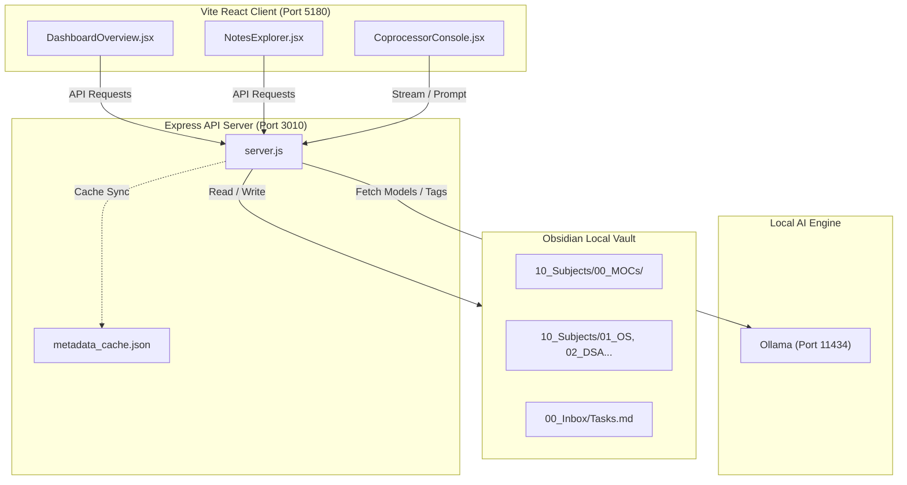

# 📘 Second Brain: Developer Handbook

Welcome to the **Second Brain Developer Handbook**. This guide provides an architecture overview, detailed API endpoints specifications, vault parsing rules, and deployment instructions for developers contributing to this system.

---

## 🏛️ System Architecture

The Second Brain platform uses a hybrid local architecture consisting of four main layers:



*   **Vite React Client**: Renders the glassmorphic desktop interface. It communicates with the backend REST API and handles local view states (MOC Hub directories, interactive flashcard flips).
*   **Express API Server**: Serves as the system bridge. It performs file system read/writes inside the Obsidian vault, compiles the incremental metadata cache, parses tasks/flashcards, and proxies LLM streams.
*   **Obsidian Local Vault**: The source of truth. Contains all subject notes, Map of Content files, and task listings structured in standard GitHub Flavored Markdown.
*   **Ollama Engine**: Operates as a local LLM daemon, allowing offline note refinements and chatbot reasoning.

---

## 🔌 API Endpoint Registry

### 1. Note Catalog Mappings

#### `GET /api/notes`
*   **Description**: Scans the vault directory structure and returns flat metadata of all concept notes. Utilizes the cached metadata parser.
*   **Response (`200 OK`)**:
    ```json
    [
      {
        "title": "Data Structures & Algorithms MOC",
        "filename": "DSA MOC.md",
        "relativePath": "10_Subjects/00_MOCs/DSA MOC.md",
        "absolutePath": "C:/Users/ishar/Projects/SecondBrain/10_Subjects/00_MOCs/DSA MOC.md",
        "subject": "MOC",
        "size": 3974,
        "updatedAt": "2026-06-19T18:06:39.360Z"
      }
    ]
    ```

#### `GET /api/notes/content`
*   **Query Parameters**: `filePath` (URI Encoded absolute path)
*   **Description**: Reads and returns the raw string content of a note.
*   **Response (`200 OK`)**:
    ```json
    {
      "content": "# Data Structures & Algorithms MOC\n..."
    }
    ```

#### `POST /api/notes/save`
*   **Request Body**:
    ```json
    {
      "filePath": "C:/Users/ishar/Projects/SecondBrain/10_Subjects/02_Data_Structures/Array.md",
      "content": "# Array\nAn array is a linear data structure..."
    }
    ```
*   **Description**: Writes markdown content back to disk and triggers an incremental cache update.

---

### 2. Spaced Repetition Flashcards

#### `GET /api/flashcards`
*   **Description**: Reads all cards from the cache, generated by parsing raw subject files.
*   **Response (`200 OK`)**:
    ```json
    [
      {
        "subject": "OS",
        "question": "What is a deadlock?",
        "answer": "A state where a set of processes are blocked because each process is holding a resource and waiting for another resource held by some other process.",
        "source": "Deadlock Basics.md"
      }
    ]
    ```

---

### 3. Task Management (Obsidian Synchronized)

#### `GET /api/tasks`
*   **Description**: Parses the checkable list items in `00_Inbox/Tasks.md`.
*   **Response (`200 OK`)**:
    ```json
    [
      {
        "id": "task-0",
        "text": "Review [[OS MOC]]",
        "completed": false
      }
    ]
    ```

#### `POST /api/tasks/add`
*   **Request Body**: `{ "text": "Task description [[WikiLink]]" }`
*   **Description**: Appends a new checkable bullet `* [ ] Task description [[WikiLink]]` to the bottom of `00_Inbox/Tasks.md`.

#### `POST /api/tasks/toggle`
*   **Request Body**: `{ "text": "Task description", "completed": true }`
*   **Description**: Modifies the matching checkbox state (`[ ]` or `[x]`) directly in `00_Inbox/Tasks.md`.

---

### 4. Ollama Integration

#### `GET /api/ollama/models`
*   **Description**: Connects to the local Ollama backend and lists downloaded models along with rounded file sizes.
*   **Response (`200 OK`)**:
    ```json
    [
      {
        "id": "mixtral:latest",
        "name": "mixtral:latest (26.3 GB)"
      }
    ]
    ```

---

## 🛠️ Obsidian Vault Parsing Rules

### 1. Spaced Repetition Card Extraction
The server parses flashcards from note markdown files using regular expressions:
*   **Format**: Double colons (`::`) or double question marks (`??`) serve as question-answer boundaries.
*   **Trigger Tag**: The file must contain the hashtag `#flashcards`.
*   **Parsing Code**:
    ```javascript
    const lines = content.split('\n');
    lines.forEach(line => {
      if (line.includes('::')) {
        const parts = line.split('::');
        const question = parts[0].replace('- [ ]', '').replace('- ', '').trim();
        const answer = parts[1].trim();
        cards.push({ question, answer });
      }
    });
    ```

### 2. Task Markdown Format
Tasks are synchronized directly from `00_Inbox/Tasks.md` via markdown bullet boxes:
*   **Format**: `* [ ] Text` or `* [x] Text`.

---

## 🎨 Design System & Theme Customization

The system utilizes custom CSS variables inside `index.css` to render its glassmorphism interfaces:
```css
:root {
  --bg-primary: #07080b;
  --bg-card: rgba(255, 255, 255, 0.01);
  --border-color: rgba(255, 255, 255, 0.05);
  --border-color-active: rgba(139, 92, 246, 0.3);
  
  --accent-primary: #8b5cf6;   /* Purple */
  --accent-success: #10b981;   /* Green */
  --accent-info: #06b6d4;      /* Cyan */
  --accent-error: #ef4444;     /* Red */
  
  --font-display: 'Outfit', sans-serif;
  --font-sans: 'Inter', sans-serif;
}
```
All cards must use the `glass-panel` className to inherit transparency filters, backdrops, and borders.
